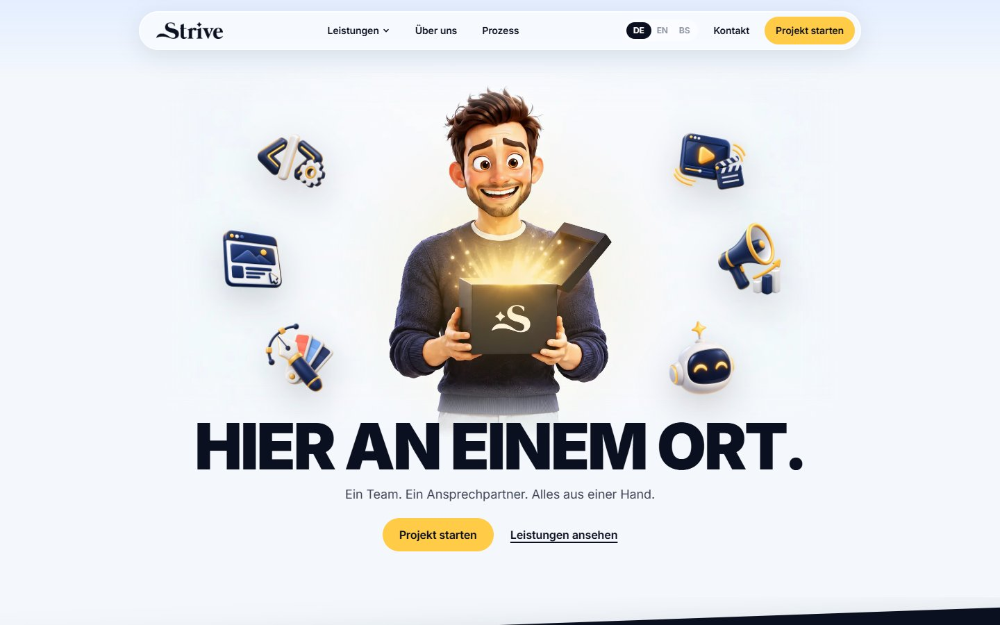
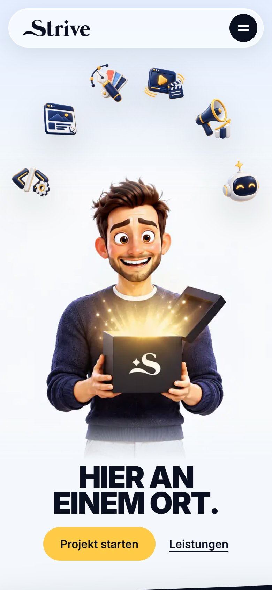

# Strive – Agency Website

Website for **Strive**, a digital agency offering software development, websites, design, video and motion, marketing and AI automation. The site targets clients in the DACH region, so all content is in German and includes the legal pages Austrian and German businesses need (Impressum, Datenschutz).

<p>
  
  &nbsp;
  
</p>

**Stack:** Next.js 16 (App Router) · React 19 · TypeScript · Tailwind CSS 4 · GSAP ScrollTrigger · Lenis

---

## Highlights

**Scroll-driven hero animation**
The hero is a 132-frame image sequence drawn on a `<canvas>` and scrubbed by scroll position with GSAP ScrollTrigger. Service icons fly out of the opening box to their final positions, and all overlays are positioned in image-relative coordinates so they stay aligned with the render at any viewport size. Desktop and mobile have separate frame sets and stage geometry ([`src/components/hero/`](src/components/hero)).

**Content separated from code**
All copy, navigation, service descriptions and form messages live in one typed file, [`src/content/de.ts`](src/content/de.ts). Portfolio entries live in [`src/content/projects.ts`](src/content/projects.ts). Adding a service or project means editing data, not components.

**Statically generated service pages**
`/leistungen/[slug]` is built from the content file with `generateStaticParams` and gets per-page metadata from `generateMetadata`.

**Contact form with a Server Action**
[`src/app/actions/contact.ts`](src/app/actions/contact.ts) validates input on the server, returns field errors without losing what the user typed, and includes a honeypot field against spam bots. Email delivery is not connected yet (marked as a TODO).

**Smooth scrolling and reveal effects**
Lenis smooth scrolling is synchronized with GSAP and offsets anchor links for the fixed header. Sections reveal on scroll through a small `IntersectionObserver` helper.

**Portfolio screenshot tool**
[`scripts/capture-site.mjs`](scripts/capture-site.mjs) uses Playwright to take full-page desktop and mobile screenshots of client sites. It declines cookie banners, hides popups and scrolls through the page so lazy-loaded images appear.

## Pages

| Route | Content |
|---|---|
| `/` | Hero animation, services, why Strive, process, contact |
| `/leistungen` | All six services |
| `/leistungen/[slug]` | Detail page per service, with related portfolio projects |
| `/ueber-mich` | About me |
| `/impressum`, `/datenschutz` | Legal notice and privacy policy |

## Project structure

```
src/
  app/             routes, layout, server action for the contact form
  components/      sections, header and footer, hero animation, project gallery
  content/         de.ts (all copy) and projects.ts (portfolio data)
  lib/             Lenis instance, scroll-reveal helper
public/
  sequence/        hero animation frames (desktop and mobile)
  projects/        portfolio screenshots
scripts/
  capture-site.mjs portfolio screenshot tool
```

## Running locally

```bash
npm install
npm run dev
```

The site runs at http://localhost:3000.

```bash
npm run build
npm run lint
```

## Status

- German is the only language right now. EN and BS appear in the language switch but are disabled.
- Contact form submissions are validated and logged on the server, but not yet emailed.
